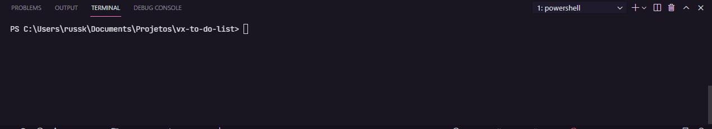

<p align=center>
  
</p>
<h1 align=center> VX To Do List Case </h1> 

  <h1 align="center">  
    <a href="https://www.typescriptlang.org/" target="_blank"  rel="noopener noreferrer" >
      
    </a>
    <a href="https://pt-br.reactjs.org/docs/getting-started.html" target="_blank"  rel="noopener noreferrer">
      
    </a>
    <a href="https://code.visualstudio.com/" target="_blank"  rel="noopener noreferrer">
      
    </a>
    <a href="https://sass-lang.com/" target="_blank"  rel="noopener noreferrer">
      
    </a>
   </h1>

<h6 align=center>
  <a href="#notebook-about">About</a>&nbsp;&nbsp;&nbsp;|&nbsp;&nbsp;&nbsp;
  <a href="#hammer-technologies">Technologies</a>&nbsp;&nbsp;&nbsp;|&nbsp;&nbsp;&nbsp;
  <a href="#black_nib-getting-started">Getting Started</a>&nbsp;&nbsp;&nbsp;|&nbsp;&nbsp;&nbsp;
  <a href="#heavy_plus_sign-upgrades">Upgrades</a>
</h6>

# :notebook: About


The **VX To Do List case** is the best simple app to manage your Tasks :D

Application made based on challenge test requested by VX Case.

Expected behaviour, data is saved when the input is out of focus:


# :hammer: Technologies

#### 📃 Dependencies: -> <i><kbd> [package.json](./package.json) </kbd></i>

- [x] <b>[Typescript](https://www.typescriptlang.org/):</b> <i>It's written in TypeScript</i>
- [x] <b>[Axios](https://github.com/axios/axios):</b> <i>Best lib to work with Promise-based HTTP client </i>
- [x] <b>[SASS](https://sass-lang.com/):</b> <i>To optimize CSS perfomance</i>
- [x] <b>[JSON Server](https://github.com/typicode/json-server):</b> <i>Fake server API creator</i>

#### 📝Custom: ->

Script created to execute JSON Server:

```json
"server": "json-server src/service/db.json -w -p 3001"
```

# :black_nib: Getting Started

You must have installed:

1. **Node.js**. <i>[Here](https://nodejs.org/en/)</i>
2. **GIT**. <i>[Here](https://git-scm.com)</i>

After that, go to the terminal and execute those steps:

```bash
  $ git clone https://github.com/gamadv/vx-todo-list-case.git
  cd vx-todo-list-case
```
Downloading dependencies:
```bash
  $ npm install

  # or

  $ yarn
```
Starting app && server:

**PS:** <br/>App starts in -> **/3000**<br/> JSON Server starts in -> **/3001**

```bash
  $ yarn start

  #on another terminal

  $ yarn server -> to start JSON Server 
```



# :heavy_plus_sign: Upgrades:
Some features are pending, those are:
- [ ]  Responsive Layout;
- [ ]  Colocar dados em Local Storage;
- [ ]  Ordenar atributos (id ficando por último)
- [ ]  Pop-up de notificação para: Adição - Exclusão e Edição de Itens

<p align=center> 
  <h6 align=center>💙 Made by</h6> 
  <h2 align=center>
  <a href="https://www.linkedin.com/in/gama-leal">  Moacir Gama
    
  </a>
  </h2>
</p>
